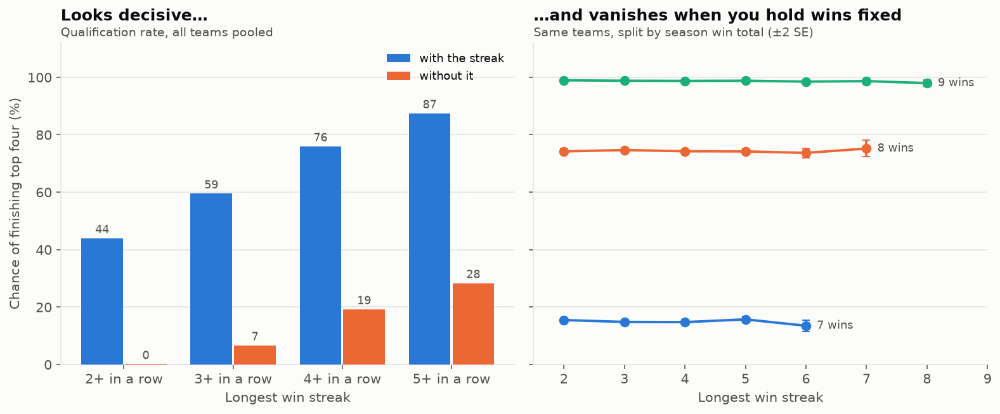
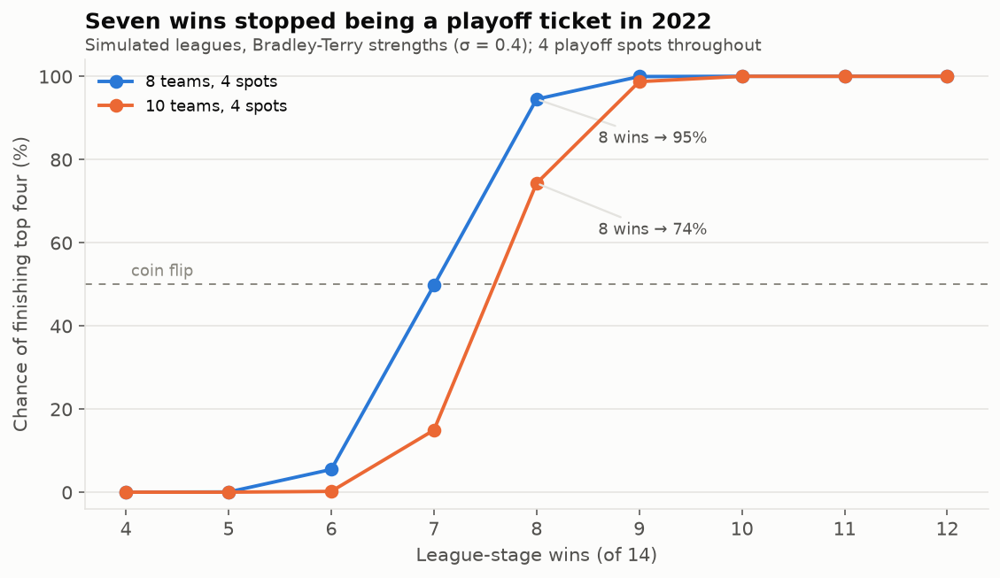

# IPL Streaks, Rebuilt 🏏

**Does a winning run actually get you into the IPL playoffs — or does it just mean you won a lot of matches?**

This repository started as an analysis of that question and now contains a rebuild of it. The
rebuild exists because the original answer was wrong in four separate ways, and how it was
wrong is more instructive than the question itself.

📓 **Start here: [`notebooks/ipl_streaks_rebuilt.ipynb`](notebooks/ipl_streaks_rebuilt.ipynb)** — the
current analysis, executed with outputs.

---

## What changed, and why

| v1 claim | Status | v2 finding |
|---|---|---|
| A streak-capped team reaches 7+ wins **8.7%** of the time | ❌ arithmetic error | **24.7%**. v1 divided the qualifying count by all 16,384 sequences instead of the 5,768 that satisfy the constraint — a joint probability reported as a conditional one |
| …but **40.6%** in simulation, so "math models underestimate the difficulty" | ❌ different model | The simulation forced a *free* loss after every second win. That is a different stochastic process, and it flatters the team. Like-for-like, there is no gap to explain — and it points the opposite way |
| Only **~40%** of average teams manage a 3-match win streak | ❌ off by 25 points | **64.8%** at a 50% win rate. 40% is the *weak*-team number (42.7%) |
| 7 wins gives you a chance, 8 wins is basically safe | ⚠️ era-dependent | True when 8 teams chased 4 places. Since 2022: 7 wins ≈ **15%**, 8 wins ≈ **74%**, and **9 wins** is the real safety line |
| Teams with 3+ win streaks qualify; teams without them don't | ❌ confounded | The identical pattern appears in a simulated league built with **zero momentum**. Hold the win total fixed and the streak effect is flat |

### The headline result

A team's longest win streak is *mechanically produced* by how many matches it won. So "streak teams
qualify" and "teams that win a lot qualify" look identical in the data whether or not momentum
exists.

To show this, `src/league.py` simulates a full ten-team league in which each team's results are
placed in **uniformly random order** — there is no momentum in the data-generating process, by
construction. v1's finding reproduces there anyway:

| | qualify with the streak | without it |
|---|---|---|
| 3+ wins in a row | **59.5%** | **6.6%** |

…and vanishes entirely once you compare teams with the same win total:

| longest streak | 7 wins | 8 wins | 9 wins |
|---|---|---|---|
| 2 | 15.5% | 74.2% | 98.9% |
| 4 | 14.7% | 74.2% | 98.7% |
| 6 | 13.5% | 73.7% | 98.5% |

A logistic regression tells the same story: `max_streak` alone has an odds ratio of 3.42 with
*z* ≈ 303; add the win total and its coefficient falls to −0.010 (*p* = 0.14) with **no** improvement
in fit (pseudo-*R*² 0.746 either way).



### The most useful practical finding

The league format changed what a win total is worth, and the old rule of thumb never caught up:



Eight teams chasing four places meant *half the league qualified*. Ten teams chasing the same four
places means seven wins is a lottery ticket, not a position. The 4th-place cutoff now lands on
**16 points** most often — which is exactly why net run rate keeps deciding IPL playoff races.

---

## What's in here

```
src/streaks.py     exact distributions of (wins, longest streak) by DP — no simulation error
src/league.py      whole-league season simulator; wins are conserved, qualification is relative
src/momentum.py    within-season permutation test, runs test, conditioning on the win total
src/cricsheet.py   real IPL results from Cricsheet, with a per-season validation report
src/analysis.py    the analyses, as functions returning tidy frames
src/viz.py         figures
run_analysis.py    reproduce every number and figure
tests/             100 tests, including brute-force checks of every DP result
```

### Run it

```bash
pip install -r requirements.txt
python -m pytest -q          # 100 tests
python run_analysis.py       # writes reports/results.json and reports/figures/*.png
streamlit run ipl_streamlit_complete_app.py
```

### Run it on real IPL data

```bash
python run_analysis.py --with-data
```

This downloads [Cricsheet](https://cricsheet.org)'s IPL archive (~5 MB, CC BY 4.0) and runs the
momentum test on every real team-season. Two design choices matter:

- **Season comes from match dates**, not Cricsheet's `season` field, which is inconsistent
  ("2007/08", "2020/21", "2023"). Every IPL season sits inside one calendar year. This is also why
  **2026 needs no code change** — whatever seasons the archive holds are picked up automatically.
- **Qualification is read off the data**: a team qualified in season *Y* iff it appears in a playoff
  match that season. No need to reconstruct net run rate from deliveries, which is fiddly once
  Duckworth–Lewis and the all-out-counts-as-full-quota rule are involved.

A `validate()` report runs first and flags any season where teams played unequal numbers of league
matches, points don't sum to 2 per match, or the qualifier count isn't 4. **Read it before trusting
anything downstream.**

> ⚠️ **Not yet run against real data.** cricsheet.org, ESPNcricinfo, Kaggle and iplt20.com are all
> unreachable from the sandbox this rebuild was written in, so the loader is verified against
> synthetic fixtures in Cricsheet's exact JSON layout (`tests/test_cricsheet.py`) rather than against
> the live archive. Everything else — the exact probabilities, the league simulation, the confound
> demonstration — is mathematics or simulation with a known generating process and does not depend on
> it. Run the command above locally and the real-data section fills itself in.

---

## Method notes worth stealing

Three habits did all the work here, and none of them is cricket-specific:

1. **Write the probability out in words before you divide.** v1's central error was a joint
   probability used as a conditional one. Saying "P(7+ wins *given* the constraint)" out loud names
   the denominator for you.
2. **Simulate the null world.** Before believing a finding, build a world where your hypothesis is
   false and check whether the finding still appears. If it does, it isn't evidence. This took twenty
   minutes and overturned the entire conclusion.
3. **Check the power before you report a null.** A within-season permutation test on ~170
   team-seasons detects a 10-point momentum effect 79% of the time and a 15-point one 98% of the
   time — but only 35% of the time at 5 points. Knowing that in advance is what makes a null result
   mean something.

## Known limitations

- Bradley–Terry strength dispersion (σ) is a **parameter, not a fitted value**. Results are reported
  across σ ∈ {0.0, 0.4, 0.8}; the ordering never changes and the 10-team figure for 7 wins moves only
  between 13% and 17%. Fitting σ to real results is the first thing to do once you have the data.
- Net run rate in the simulation is a **proxy** (mean signed match margin), used only as a tiebreak.
  Real NRR from deliveries would be better and is a natural next step.
- The simulator assumes no home advantage and no in-season strength drift (injuries, form, travel).
- The momentum test does not yet control for **opponent strength**. A team that draws three weak
  opponents in a row produces a streak with no psychology involved — that is the most likely
  explanation for any streakiness that does turn up, and the natural follow-up.

## Historical files

`ipl-winning-streaks-analysis.ipynb` and `IPL_Playoff_Qualification_Analysis_FULL.ipynb` are the v1
notebooks, kept as the record of what was corrected. Their numbers are superseded by the table above.
`IPL_Playoff_Streak_Analysis_GitHub_Package.zip` is a stale copy of the old app and README.

## Data & licence

Match data: [Cricsheet](https://cricsheet.org), CC BY 4.0. Code: MIT.
